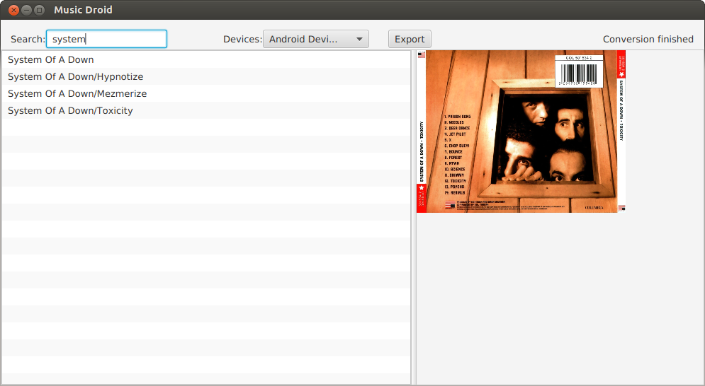

# MusicDroid
Desktop application to move music albums to an android device.

## System requirements

- Java 8

## How to use it

### Install in Ubuntu/Debian

Download the latest version from https://github.com/adelolmo/musicdroid/releases/latest

    $ cd /tmp
    $ wget https://github.com/adelolmo/musicdroid/releases/download/v1.3/musicdroid-1.3.deb
    $ sudo dpkg -i picasa-crawler-1.3.deb
    
### Install in other Systems

Download the latest version from https://github.com/adelolmo/musicdroid/releases/latest

### Download

Download the tar ball from 'releases' and extract it in your computer. e.g. in your home directory.

    $ cd $HOME
    $ wget https://github.com/adelolmo/musicdroid/releases/download/v1.3/musicdroid-1.3-dist.tar.gz
    $ mkdir $HOME/musicdroid
    $ tar zxvf musicdroid-1.3-dist.tar.gz -C $HOME/musicdroid
    
### Run

#### In Ubuntu/Debian

Go the the menu "Applications -> Others -> musicdroid"

Or execute /opt/musicdroid/musicdroid

#### In other Systems
        
Go to the directory where musicdroid was extracted.

    $ $HOME/musicdroid/startup.sh

## How to Build it

### Install JADB dependency
    $ cd /tmp
    $ wget https://github.com/adelolmo/jadb/releases/download/jadb-1.1/jadb-1.1.jar 
    $ mvn install:install-file \
    -Dfile=/tmp/jadb-1.1.jar \
    -DgroupId=se.vidstige \
    -DartifactId=jadb \
    -Dversion=1.1 \
    -Dpackaging=jar

### Build Music Droid
    $ git clone https://github.com/adelolmo/musicdroid.git
    $ mvn clean install
    
