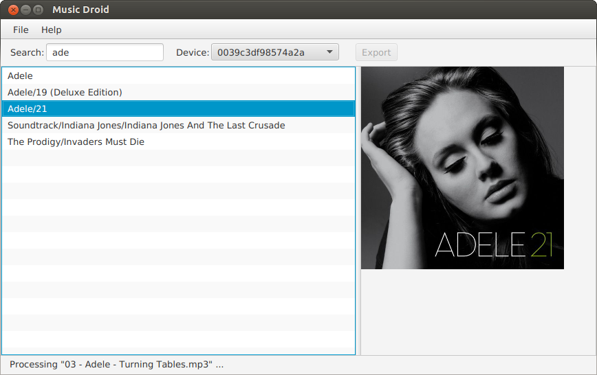

# MusicDroid
Desktop application to move music albums to an android device.

## How to Install it

### Download

Download the tar ball from 'releases' and extract it in your computer. e.g. in your home directory.

    $ wget https://github.com/adelolmo/musicdroid/releases/download/v1.1/musicdroid-1.1-dist.tar.gz
    $ mkdir $HOME/musicdroid
    $ tar zxvf musicdroid-1.1-dist.tar.gz -C $HOME/musicdroid
    
### Run it

    $ $HOME/musicdroid/startup.sh

## How to Build it

### Install JADB dependency
    $ cd /tmp
    $ wget https://github.com/adelolmo/jadb/releases/download/jadb-1.1/jadb-1.1.jar 
    $ mvn install:install-file \
    -Dfile=/tmp/jadb-1.1.jar \
    -DgroupId=se.vidstige \
    -DartifactId=jadb \
    -Dversion=1.1 \
    -Dpackaging=jar

### Build Music Droid
    $ git clone https://github.com/adelolmo/musicdroid.git
    $ mvn clean install
    
